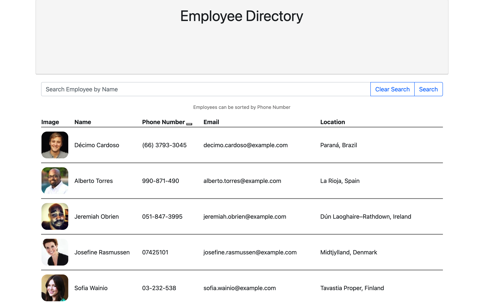
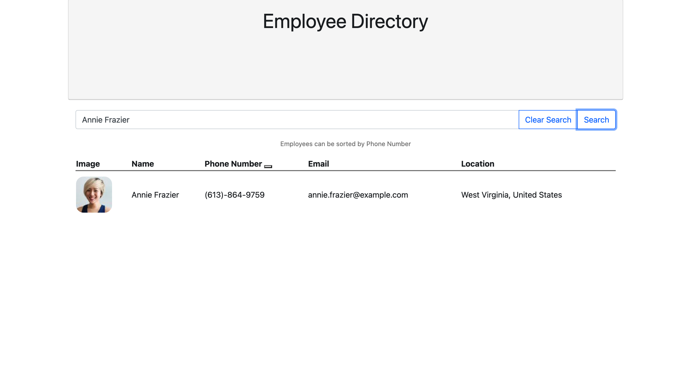

# Employee Directory

## Description
This app provides a detailed list of employees using React.

## Table of Contents

- [Technologies](#Technologies) 
- [Contributing](#Contributing)
- [License](#License)
- [Test](#Test)
- [Questions](#Questions)

##  User Story
As a user, I want to be able to view my entire employee directory at once so that I have quick access to their information.

##  Technologies
<li>HTLM</li>
<li>CSS</li>
<li>JavaScript</li>
<li>React.js </li>

##  Contributing
Contributions are welcomed

##  License
MIT

## Test
Feel free to test the application and share feedback.

## Questions
Please feel free to reach me with additional questions: lismeyplasencia@gmail.com
GitHub profile: Lismey23

## Image of Deployed Application 

## Example of Search function
 

